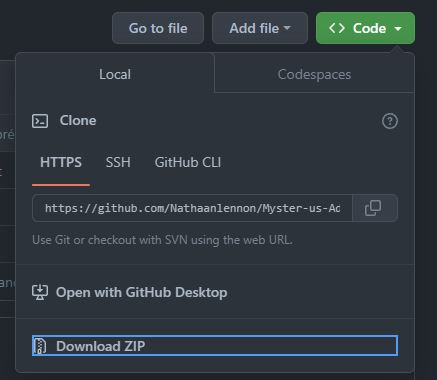

# Myster-us-Adventures
Un jeu de RPG à plusieurs joueurs, mélangé à un memory.<br>
Tenterez-vous de partir à l'aventure à la recherche d'une arme antique et d'un trésor enfouis dans les profondeurs d'un donjon rempli de monstres ?<br>
Frayez-vous un chemin dans le donjon, vainquez les monstres sur votre chemin, souvenez-vous des cases cachées, et soyez le premier à dévoiler votre arme antique et au moins un trésor pour remporter la victoire.

## Règles
Il y a un tutoriel au sein même du jeu ! Depuis le menu, accédez au tutoriel qui vous expliquera toutes les règles du jeu.

## Menu
Le menu comporte plusieurs options : "JOUER" pour démarrer le jeu, "SCORES" pour visualiser les scores des joueurs ayant joué sur votre machine, et "TUTORIEL" pour accéder au tutoriel et lire les règles du jeu ainsi que quelques informations à propos de l'histoire. Il vous suffit de taper le même numéro que celui à côté de l'option que vous voulez lancer.

### Scores
Les scores, accessibles depuis le menu, affichent :
* le nom de chaque joueur ayant déjà terminé une partie sur votre machine
* son nombre de parties jouées
* son nombre de victoires
* le nombre de monstres qu'il a terrassés
* le nombre de trésors qu'il a découverts
* le nombre de cases qu'il a révélées
<br>Les scores sont aussi lisibles depuis le fichier `scores.txt`. Ce fichier sera automatiquement créé à la fin de votre première partie.
<br>**Évitez de supprimer ce fichier si vous ne voulez pas perdre les scores déjà enregistrés.**

## Démarrage d'une partie
En démarrant une partie, il vous sera demandé de :
* Choisir la dimension du labyrinthe. Le jeu classique se joue sur un labyrinthe de dimension 5. (5 lignes, 5 colonnes). Vous pourrez choisir à votre guise une dimension comprise entre [5;15].
* Renseigner le nombre de joueurs. Au minimum 2, au maximum 4.
* Renseigner le nom de chaque joueur. Le premier joueur sera le premier à jouer, le deuxième sera le deuxième à joueur, et ainsi de suite.
<br>Il ne vous restera plus qu'à commencer la partie après cela.

## Préréquis
* Make
* Git
* Linux

## Instructions d'installation et de démarrage
1. Téléchargez le fichier zip `Myster-us-Adventures.zip` depuis GitHub.
<br><br>
2. Dézippez-le dans le répertoire de votre choix.
3. Ouvrez une fenêtre de terminal, et entrez dans le répertoire où vous l'avez dézippé avec la commande `cd`
4. Puis entrer dans le répertoire `Myster-us-Adventures` :
```
cd Myster-us-Adventures
```
5. Une fois dans le répertoire, compilez avec make :
```
make run
```
6. Le jeu sera lancé
